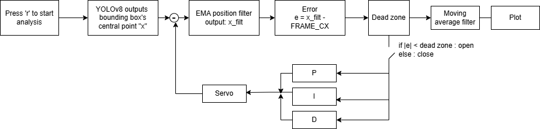

# Jetson YOLO PID Face Tracker

Real-time horizontal face tracking on NVIDIA Jetson Orin Nano. A YOLO face detector locates the target in CSI camera frames, and a PID controller adjusts a servo through a PCA9685 PWM module over I2C.

This repository includes the supplied Python programs, experiment media, and English documentation based on the 24-slide April 16 meeting report. The long-term research goal is visual alignment for underwater free-space optical communication (UW-FSO). The demonstrated prototype tracks faces on one axis. Underwater ship detection and LED alignment remain future work.

## Repository contents

| Path | Contents |
| --- | --- |
| `src/yolo_servo_pid_tracker.py` | Original detector, PID controller, servo control, and live response plots |
| `src/test_servo.py` | Original PCA9685 channel 0 servo sweep test |
| [English meeting report](docs/meeting-report-en.md) | Presentation-based experiment summary and future plans |
| [Original presentation PDF](docs/meeting-report-original.pdf) | Snapshot of the source slides, in their original language |
| `media/images/` | Original filtered/unfiltered control-flow diagrams and setup photograph |
| `media/videos/` | Original demonstration recordings and lossless parts for the largest recording |
| `SOURCE_MANIFEST.csv` | Original names, source URLs, sizes, paths, and SHA-256 hashes |

## Control loop

1. Capture 1280 × 720 frames at a requested 30 FPS through NVIDIA Argus and GStreamer.
2. Mirror the frame and run YOLO at inference size 640 with confidence threshold 0.5.
3. Select the detection with the highest confidence and compute horizontal error as `detection_center_x - 640` pixels.
4. Hold the servo inside the dead zone. Otherwise calculate `Kp * error + Ki * integral(error) + Kd * derivative(error)`.
5. Add the correction to the current servo angle, clamp it to the configured limits, and send the command through PCA9685.
6. Display the camera feed and histories of error, PID terms, correction, and servo angle.

The controller clamps the integral, resets it at servo limits, and decays it inside the dead zone or when no target appears. The direction depends on the mounting and mirrored image. Set `SERVO_REVERSE` as needed.

## Hardware and software

- Jetson Orin Nano with a compatible Jetson Linux/JetPack environment.
- CSI camera and an enabled I2C connection to PCA9685.
- Servo on PCA9685 channel 0 with suitable power and a common ground.
- Python 3, PyGObject/GStreamer, NumPy, OpenCV, PyTorch, Ultralytics, Adafruit Blinka and Adafruit CircuitPython ServoKit.
- Compatible face model weights. The supplied program expects `/home/jetson/yolov8n-face.pt`, but the weights are absent from the Drive folder.

The source does not specify exact JetPack or package versions. Use PyTorch and camera/GStreamer packages compatible with the installed Jetson environment. The presentation reports a resolved package compatibility problem but does not provide an environment lock file.

## Running the supplied programs

1. Install the dependencies in your Jetson environment and enable the required I2C interface.
2. Supply the face model and edit `MODEL_PATH` in `src/yolo_servo_pid_tracker.py`.
3. Check servo channel, pulse range, angle limits, camera pipeline, and direction before tracking.
4. Run the servo check if its full 0°/90°/180° sweep is appropriate for your mount:

   ```bash
   python3 src/test_servo.py
   ```

   Stop with Ctrl+C. This check uses 500–2500 µs pulses and does not apply the tracker's 5°–175° soft limits.

5. Start tracking in a graphical Jetson session:

   ```bash
   python3 src/yolo_servo_pid_tracker.py
   ```

   Press `q` or Esc to quit. Normal cleanup stops the pipeline and returns the servo to 90°.

## Current source defaults

| Setting | Value |
| --- | --- |
| `KP`, `KI`, `KD` | `0.003`, `0.005`, `0.0001` |
| Dead zone | 80 pixels |
| Servo channel | 0 |
| Initial / soft-limit angles | 90° / 5°–175° |
| Pulse range | 500–2500 µs |
| Maximum correction | ±30° per controller update |
| Target | Highest-confidence detection |
| Analysis | Separate OpenCV window, 300 history samples |

## Findings from the presentation

The report compares proportional gains of 0.001, 0.003, and 0.005. It identifies 0.003 as the best balance between speed and stability in the reported setup. A gain of 0.005 reaches the setpoint fastest but produces persistent oscillation. A gain of 0.001 responds more slowly.

The report also discusses EMA and moving-average filtering, with filtered examples using dead zones of 40 pixels for 5 seconds, 10 pixels for 5 seconds, and 10 pixels for 12 seconds. These are historical experiment settings. The provided Python file has no EMA or moving-average tracking filter and no `r` recording handler, although the report describes recording with `r`. Its default dead zone is 80 pixels.




No raw numerical experiment dataset or exact filter parameters accompany the two diagrams. The published files preserve the supplied programs and recordings. This repository organization did not rerun hardware experiments.

## Demonstration recordings

- [IMG_6710.MOV](media/videos/IMG_6710.MOV)
- [IMG_6691.MOV](media/videos/IMG_6691.MOV)
- [MP4 recording](media/videos/video_606378700740493636-BBkoy214.MP4)
- `IMG_6699.MOV` is stored in two lossless parts to fit GitHub's browser upload limit. Restore it with `python3 tools/restore_video.py` from the repository root. The script checks its original SHA-256 hash.

The source folder does not map individual recordings to specific PID/filter settings, so their original filenames remain intact.

## Future work from the report

- Extend the controller to both horizontal and vertical axes.
- Train a rolling-shutter-pattern detector or another model suitable for recognizing ships.
- Demonstrate real-time pattern tracking in free space before applying the alignment approach to UW-FSO.

## Sources

- [Original Drive folder](https://drive.google.com/drive/folders/1NwTPREPrWODKhk9IFMnwFNzHBNTxerl6)
- [Meeting Report presentation](https://docs.google.com/presentation/d/1fAQqj434E0ylYbD4rZnKBL8-_9kuzTRB_qsPAZNE20o/edit)
- [Related ESP32–Jetson optical communication project](https://github.com/jay97186/esp32-jetson-ble)

The source authors have not supplied a license. Model weights and third-party dependencies have their own license terms.
